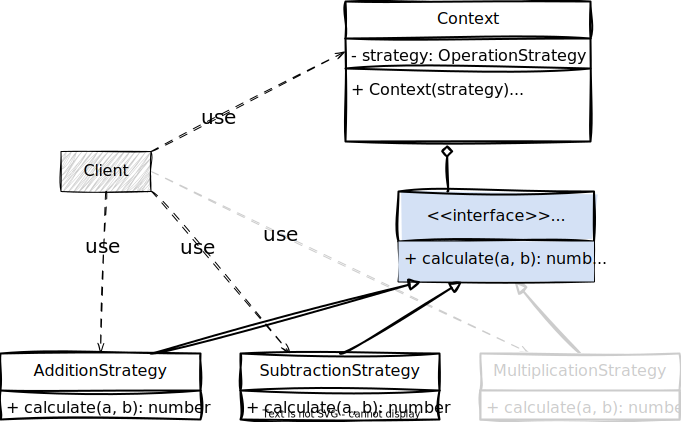

[⬅️ voltar](/src/behavioral/doc.md)

## 🚧 Strategy

O Strategy define uma família de algoritmos, encapsula cada uma delas e as torna intercambiáveis. Esse padrão permite que o algoritmo varie e seja escolhido em tempo de execução, com base numa situação, independente dos clientes.

### ⛏️ Implementação

Essa é implementação do Strategy proposta no livro Padrões de Projeto, do "GoF".

Primeiro temos a interface `OperationStrategy` (Strategy) que define a assinatura para as implementações de estratégias concretas de uma operação. Temos também o `CalculatorContext` (Context) que recebe por injeção de dependência uma estratégia de operação e implementa o método `calculate` que executa o algoritmo da estratégia recebida. O Context não sabe qual vai ser a estratégia, só sabe que ela implementa a interface `OperationStrategy`. Isso permite criar novas estratégias sem mexer no código do contexto que é que executa o método de cálculo.

~~~ts
// strategy.ts

interface OperationStrategy {
  calculate(a: number, b: number): number
}

export class CalculatorContext {
  constructor(private strategy: OperationStrategy) {
    this.strategy = strategy
  }

  setStrategy(strategy: OperationStrategy) {
    this.strategy = strategy
  }

  calculate(a: number, b: number): number {
    return this.strategy.calculate(a, b)
  }
}
~~~

Em seguida, temos as implementações concretas das operações, cada uma com o seu algoritmo específico

~~~ts
// strategy.ts

export class AdditionStrategy implements OperationStrategy {
  calculate(a: number, b: number): number {
    return a + b
  }
}

export class SubtractionStrategy implements OperationStrategy {
  calculate(a: number, b: number): number {
    return a - b
  }
}

export class MultiplicationStrategy implements OperationStrategy {
  calculate(a: number, b: number): number {
    return a * b
  }
}

export class DivisionStrategy implements OperationStrategy {
  calculate(a: number, b: number): number {
    return a / b
  }
}
~~~

E então, pode ser utilizado assim:

~~~ts
// strategy.ts

// cliente
function calculate() {
  const calculator = new CalculatorContext(new AdditionStrategy())
  console.log(calculator.calculate(10, 2)) // saída: 12

  calculator.setStrategy(new SubtractionStrategy())
  console.log(calculator.calculate(10, 2)) // saída: 8

  calculator.setStrategy(new MultiplicationStrategy())
  console.log(calculator.calculate(10, 2)) // saída: 20

  calculator.setStrategy(new DivisionStrategy())
  console.log(calculator.calculate(10, 2)) // saída: 5
}

calculate()
~~~

### 👷🏻‍♂️ Quando usar?

Utilize o Strategy quando houver a necessidade de alguma estrutura de testes (utilizando um aninhamento de `if` ou bloco `switch`, por exemplo) para variar o algoritmo (a lógica) que vai tratar uma solicitação.
