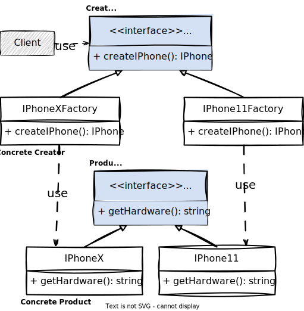

[⬅️ voltar](/src/creational/doc.md)

## Factory Method

O Factory Method define uma interface para criar um objeto, mas deixar as subclasses decidirem que classe instanciar. Ele faz isso através de um método de criação de objetos, assim, ao invés de fazer uma chamada direta ao construtor (utilizando o `new`), as subclasses, ou as classes que irão implementar a interface do criador, chamadas de `Concrete Creator`, podem então substituir esse método para alterar o produto que será criado.

### Exemplos

**Antes do Factory Method**

A função `orderIPhone` têm uma referência tanto para a interface ou classe abstrata de `IPhone` (Product) quanto para as suas implementações concretas (ConcreteProduct).

~~~ts
// before-factory-method.ts

export interface IPhone {
  getHardware(): string
}

export PhoneX implements IPhone {
  getHardware(): string {
    return 'hardware do IPhoneX'
  }
}

export class IPhone11 implements IPhone {
  getHardware(): string {
    return 'hardware do IPhone11'
  }
}

// client
export function orderIPhone(): IPhone {
  const device: IPhone = new IPhoneX()
  // const device = new IPhone11()
  return device
}

const device = orderIPhone()
console.log(device.getHardware()) // saída: hardware do IPhoneX
~~~

**Depois do Factory Method**

Essa é a implementação do Factory Method proposta no livro Padrões de Projeto, do "GoF".

Primeiro, temos uma interface `IPhone` (Product) e suas implementações concretas (Concrete Product), como no primeiro exemplo, sem o Factory.

~~~ts
// after-factory-method.ts

export interface IPhone {
  getHardware(): string
}

export class IPhoneX implements IPhone {
  getHardware(): string {
    return 'hardware do IPhoneX'
  }
}

export class IPhone11 implements IPhone {
  getHardware(): string {
    return 'hardware do IPhone11'
  }
}
~~~

Em seguida temos a interface `IphoneFactory` (Creator) e as suas implementações (Concrete Creator)

~~~ts
// after-factory-method.ts

export interface IPhoneFactory {
  createIPhone(): IPhone
}

export class IPhoneXFactory implements IPhoneFactory {
  createIPhone(): IPhone {
    return new IPhoneX()
  }
}

export class IPhone11Factory implements IPhoneFactory {
  createIPhone(): IPhone {
    return new IPhone11()
  }
}
~~~

E então, pode ser utilizado assim

~~~ts
// after-factory-method.ts

// cliente
function orderIPhone(): IPhone {
  const factory = new IPhoneXFactory()
  return factory.createIPhone()
  // const factory = new IPhone11Factory()
  // return factory.createIPhone()
  return device
}

const device = orderIPhone()
console.log(device.getHardware()) // saída: hardware do IPhoneX
~~~

**Simple Factory**

Chama-se "simples" por ter uma complexidade menor, podendo variar a implementação do produto dependendo apenas de uma lista de parâmetros.

~~~ts
// simple-factory.ts

export interface IPhone {
  getHardware(): string
}

export class IPhoneX implements IPhone {
  getHardware(): string {
    return 'hardware do IPhoneX'
  }
}

export class IPhone11 implements IPhone {
  getHardware(): string {
    return 'hardware do IPhone11'
  }
}

export class IPhoneSimpleFactory {
  static createIPhone(model: string): IPhone {
    if (model === 'x') {
      return new IPhoneX()
    }
    if (model === '11') {
      return new IPhone11()
    }
    throw new Error('modelo inválido')
  }
}

// client
function orderIPhone(): IPhone {
  const factory = new IPhoneSimpleFactory()
  const device = factory.createIPhone('x')
  // const device = factory.createIPhone('11')
  return device
}

const device = orderIPhone()
console.log(device.getHardware()) // saída: hardware do IPhoneX
~~~

**Half Simple Factory**

Esse é um meio termo. A fábricas não criam apenas um objeto (como no caso do Factory Method) e também não criam qualquer objeto à partir de uma lista de parâmetros, nesse caso, cada fábrica (Concrete Creator) somente pode cria um conjunto específico de sub produtos (Concrete Product).

~~~ts
// half-simple-factory.ts

export interface IPhone {
  getHardware(): string
}

export class IPhoneX implements IPhone {
  getHardware(): string {
    return 'hardware do IPhoneX'
  }
}

export class IPhoneXSMax implements IPhone {
  getHardware(): string {
    return 'hardware do IPhoneXSMax'
  }
}

export class IPhone11 implements IPhone {
  getHardware(): string {
    return 'hardware do IPhone11'
  }
}

export class IPhone11Pro implements IPhone {
  getHardware(): string {
    return 'hardware do IPhone11Pro'
  }
}

export interface IPhoneFactory {
  createIPhone(model: string): IPhone
}

export class IPhoneXFactory implements IPhoneFactory {
  createIPhone(model: string): IPhone {
    if (model === 'standard') {
      return new IPhoneX()
    }
    if (model === 'xsmax') {
      return new IPhoneXSMax()
    }
    throw new Error('modelo inválido')
  }

  static createIPhone(model: string): IPhone {
    return IPhoneXFactory.createIPhone(model)
  }
}

export class IPhone11Factory implements IPhoneFactory {
  createIPhone(model: string): IPhone {
    if (model === 'standard') {
      return new IPhone11()
    }
    if (model === 'pro') {
      return new IPhone11Pro()
    }
    throw new Error('modelo inválido')
  }

  static createIPhone(model: string): IPhone {
    return IPhoneXFactory.createIPhone(model)
  }
}

// client
function orderIPhone(): IPhone {
  const factory = new IPhoneXFactory()
  const device = factory.createIPhone('xsmax')
  // const factory = new IPhone11Factory()
  // const device = factory.createIPhone('pro')
  return device
}

const device = orderIPhone()
console.log(device.getHardware()) // saída: hardware do IPhoneXSMax
~~~

### Quando usar?

Quando existem muitas formas de se implementar uma mesma interface envolvendo alguma lógica faz sentido utilizar uma fábrica dedicada ao invés de ter código duplicado.
